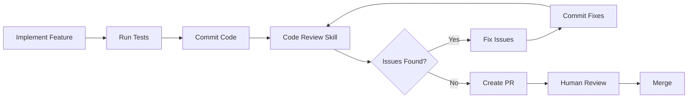

# Code Review Skill

Automated code review using CodeRabbit CLI with systematic issue fixing workflow.

## Overview

This skill integrates CodeRabbit into your development workflow to:
- Automatically analyze code changes before creating PRs
- Identify security vulnerabilities, bugs, and code quality issues
- Create actionable task lists from findings
- Systematically fix all critical and high-priority issues
- Ensure code quality standards are met before merge

## When to Use

**Automatically invoke this skill:**
- After completing task implementation
- Before creating a pull request
- As the final step in the task completion workflow

**Standard workflow:**
```
Implement feature → Run tests → Commit → [CODE REVIEW SKILL] → Fix issues → Create PR
```

## Prerequisites

### 1. Install CodeRabbit CLI

```bash
# Install via npm (recommended)
npm install -g @coderabbit/cli

# Or via homebrew
brew install coderabbit
```

### 2. Authenticate CodeRabbit

```bash
coderabbit auth
```

Follow the prompts to authenticate with your GitHub account.

### 3. Verify Installation

```bash
# Check installation
which coderabbit

# Test it works
coderabbit --help
```

## Usage

### Quick Start

Simply invoke the skill after completing your implementation:

```
You: I've finished implementing the sports tracking feature
Claude: Let me run the code-review skill to analyze your changes before we create the PR
```

Claude will automatically:
1. Run CodeRabbit analysis
2. Parse findings by severity
3. Create a prioritized task list
4. Fix all critical and high issues
5. Commit fixes separately
6. Generate a summary report

### Manual Invocation

You can also manually trigger the skill:

```bash
# Analyze uncommitted changes
coderabbit --prompt-only --type uncommitted

# Analyze changes compared to develop
coderabbit --prompt-only --base develop

# Get full detailed output (not recommended for Claude - verbose)
coderabbit
```

## Understanding Issue Severity

### 🔴 CRITICAL (Must Fix)
- **Security vulnerabilities**: SQL injection, XSS, CSRF
- **Data loss risks**: Unsafe deletes, missing transactions
- **Race conditions**: Thread safety issues, deadlocks
- **Authentication/Authorization bypass**

**Action**: Fix immediately, block PR until resolved

### 🟠 HIGH (Must Fix)
- **Logic errors**: Incorrect calculations, broken flows
- **Memory leaks**: Resource not released
- **Performance bottlenecks**: N+1 queries, blocking operations
- **Broken functionality**: Features not working as intended

**Action**: Fix before PR, essential for merge

### 🟡 MEDIUM (Should Fix)
- **Code quality**: Duplicate code, complex logic
- **Maintainability**: Poor naming, missing abstractions
- **Tech debt**: Deprecated APIs, outdated patterns
- **Error handling**: Missing try-catch, poor validation

**Action**: Fix if time permits, or create tech debt issue

### ⚪ LOW (Optional)
- **Style preferences**: Formatting, import order
- **Documentation**: Missing comments, outdated docs
- **Minor improvements**: Variable naming, code organization

**Action**: Can safely defer or ignore

## Example Session

```
You: I've finished implementing user authentication
Claude: Great! Let me run the code-review skill to check your implementation.

[Claude runs CodeRabbit analysis]

Claude: CodeRabbit found 7 issues. Let me create a task list:

📋 Code Review Tasks:
1. [CRITICAL] Fix SQL injection in auth.repository.ts:42
2. [HIGH] Add rate limiting to login endpoint
3. [HIGH] Fix race condition in session management
4. [MEDIUM] Refactor duplicate validation logic
5. [MEDIUM] Add error handling for edge cases
6. [LOW] Update API documentation
7. [LOW] Fix import order in auth.controller.ts

[Claude systematically fixes issues]

✅ Code Review Complete

🔍 CodeRabbit Analysis:
   - Critical: 0 (1 fixed)
   - High: 0 (2 fixed)
   - Medium: 0 (2 fixed)
   - Low: 2 (deferred)

🛠️ Fixes Committed:
   - Fix SQL injection using parameterized queries (abc123)
   - Add rate limiting middleware to auth routes (def456)
   - Fix session race condition with mutex (ghi789)
   - Refactor validation logic into reusable service (jkl012)

📊 Test Results:
   - All tests passing (38/38)
   - Coverage: 89% (+2%)

✅ Ready for PR creation

Claude: Your code is now ready for PR! Shall I create one?
```

## Configuration

### Optional: CodeRabbit Config File

Create `.claude/skills/code-review/coderabbit-config.yml` to customize CodeRabbit behavior:

```yaml
# CodeRabbit Configuration
reviews:
  # Focus areas
  security: true
  performance: true
  best_practices: true

  # Severity thresholds
  fail_on:
    - critical
    - high

  # Ignore patterns
  ignore:
    - "*.test.ts"
    - "*.spec.ts"
    - "**/__tests__/**"
    - "**/migrations/**"

  # Rules
  rules:
    # Security
    - no-sql-injection
    - no-xss
    - no-secrets

    # Quality
    - no-duplicate-code
    - max-complexity: 10
    - max-function-length: 50
```

### Project-Level Configuration

Add to your project's `package.json`:

```json
{
  "scripts": {
    "review": "coderabbit --prompt-only --type uncommitted",
    "review:full": "coderabbit --base develop"
  }
}
```

Then run: `npm run review`

## Best Practices

### 1. Run Early and Often
- Don't wait until PR time
- Run after each major feature implementation
- Catch issues early when they're easier to fix

### 2. Fix Critical Issues Immediately
- Never defer security vulnerabilities
- Block PR creation if critical issues found
- Get security review for auth/payment code

### 3. Keep Commits Atomic
- One commit per logical fix
- Clear commit messages referencing issue
- Makes code review easier

### 4. Re-run After Fixes
- Verify fixes don't introduce new issues
- Confirm all critical/high issues resolved
- Check test coverage maintained

### 5. Track Tech Debt
- Create issues for deferred MEDIUM items
- Link to CodeRabbit findings
- Prioritize in next sprint

## Troubleshooting

### "coderabbit: command not found"

**Solution:**
```bash
# Check if installed
npm list -g @coderabbit/cli

# Install if missing
npm install -g @coderabbit/cli

# Authenticate
coderabbit auth
```

### "No changes detected"

**Possible causes:**
- All changes already committed
- Wrong branch/directory
- Git not initialized

**Solution:**
```bash
# Check git status
git status

# Ensure you have uncommitted changes
# Or use --base flag to compare branches
coderabbit --prompt-only --base develop
```

### "Rate limit exceeded"

**Solution:**
- Wait a few minutes
- CodeRabbit has rate limits
- Use `--type uncommitted` to reduce scope

### "Too many issues found"

**Solution:**
- Focus on CRITICAL and HIGH first
- Break large feature into smaller PRs
- Consider refactoring in separate task

## Integration with Project Workflow

This skill is part of the standard task completion flow:



## FAQ

**Q: When should I use this skill?**
A: After implementing a task, before creating a PR. It's part of the standard completion flow.

**Q: Do I need to fix all issues?**
A: CRITICAL and HIGH must be fixed. MEDIUM should be fixed if time permits. LOW can be deferred.

**Q: Can I customize what CodeRabbit checks?**
A: Yes, use `coderabbit-config.yml` to configure rules and ignore patterns.

**Q: How long does analysis take?**
A: Typically 10-30 seconds for small changes, 1-2 minutes for large changesets.

**Q: Can I run this on committed code?**
A: Yes, use `--base develop` to compare your branch against develop.

**Q: What if fixes break tests?**
A: Review the fix logic, check for side effects, and update tests if behavior intentionally changed.

## Resources

- [CodeRabbit Documentation](https://docs.coderabbit.ai)
- [CodeRabbit CLI GitHub](https://github.com/coderabbit-ai/cli)
- [Gully Project Git Workflow](../../GIT.md)
- [Gully Project Standards](../../CLAUDE.md)

## Support

For issues or questions:
1. Check troubleshooting section above
2. Review CodeRabbit docs
3. Ask in project chat/Slack
4. Create issue in project repository
